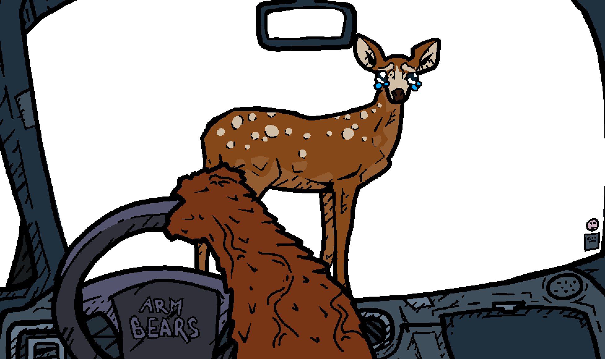
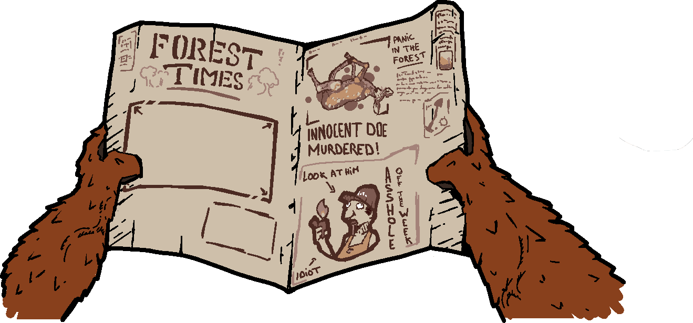

# Smokey Road Rage

Jeu de conduite trash façon "Subway Surfers" : Smokey l'ours traverse une forêt en flammes au volant de sa bagnole, change de voie pour éviter les dangers, écrase les campeurs pyromanes et essuie son pare-brise à coups de spam-espace.

Réalisé pour la game jam **bbqjam2026**, avec le moteur **Godot 4.7** (GDScript, physique Jolt).

## Le jeu

- **Déplacement par voies** (gauche/droite) — pas de contrôle libre.
- **Deux types d'obstacles** :
  - animaux et piétons : ça fait des dégâts et ça salit le pare-brise (à essuyer en spammant espace) — pas de mort automatique ;
  - décor (arbres, pierres) : collision fatale, Game Over instantané.
- **Écraser les campeurs/incendiaires est récompensé**, écraser des innocents est pénalisé.
- **Vie diégétique** : pas de barre de vie, c'est l'égaliseur de la radio qui faiblit à mesure que la santé baisse.
- **Objectif** : finir le niveau, scoring simple, sans combo.

L'intro et la fin de partie passent par le journal **Forest Times**, qui affiche le résumé de la run sous forme de gros titres.

Le pitch complet et les notes de game design sont dans [GameDesign/notes-concept-01.md](GameDesign/notes-concept-01.md) et [GameDesign/notes-brainstorm-01.md](GameDesign/notes-brainstorm-01.md).

## Lancer le jeu

Ouvrir le projet dans Godot 4.7 et lancer la scène `Scenes/level_highway.tscn` — c'est le niveau complet (voiture, obstacles, environnement).

## Structure du projet

- `Scenes/` — scènes `.tscn` (voiture, niveaux, UI)
- `Scripts/` — scripts `.gd` attachés aux scènes/nœuds
- `Visuals/` — assets graphiques
- `Audios/` — sons et musiques
- `GameDesign/` — notes de conception (référence pour les décisions de gameplay)
